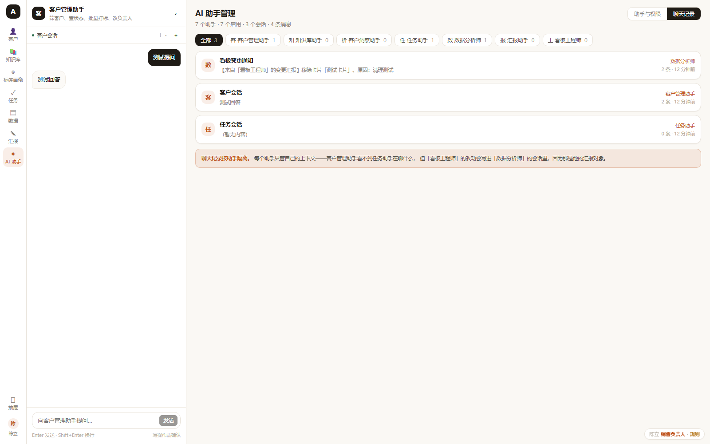

# AICRM

销售用的客户管理工具，带 AI。

做这个的起点是一个很具体的观察：销售管理工具的问题通常不是记录得不够全，而是记录完了没用起来——销售不知道该跟谁，负责人到月底不知道怎么向上汇报。所以这个项目主要在两件事上花力气：把「该跟谁」算出来，把「怎么汇报」写出来。

目前是个可运行的 MVP 原型，功能完整，能跑能点。


## 跑起来

需要 Node 22.5 或更高版本（数据库用了 Node 内置的 `node:sqlite`，不装任何数据库）。

```
git clone <仓库地址>
cd aicrm
npm run setup
npm start
```

打开 http://127.0.0.1:8787

```
账号：chenli
密码：123456
```

不配 AI Key 也能用，默认走内置的规则引擎，界面功能都能点。想接真模型的话，进「设置 → AI 服务」填自己的 Key，下面有说明。

改代码要热更新的话，开两个终端：

```
npm run dev:server     # 后端 8787
npm run dev:web        # 前端 5273
```

## 功能

### 对话工作台

左边常挂一个对话栏。它没有「选择助手」这种控件——你切到哪个页面，它就变成那个页面的助手。在客户页问「哪些客户该跟了」，它就是客户助手；切到任务页问「这周有什么要做的」，它变成任务助手。

回答不只是文字。比如你说「找出 30 天没跟进的意向客户」，右边的客户列表会直接筛出来；说「给高意向客户建任务」，任务页会出现几条待确认的操作，点了才会真的创建。

写操作都要求确认。AI 可以提议，但落库前要人点一下。


### 一键汇报

点一下生成汇报稿，分三段：整体情况、需要关注的问题、下周建议。数字是从当前客户和跟进数据里实时算出来的，不是套模板。

生成后是一段可编辑的文本，改完可以复制或导出。周报和月报两个口径。


### 知识库

分六类，其中「汇报资料」是专门放向上沟通内容的——《老板最关心的 5 个问题》《如何解释「线索变少了」》这类。销售话术和产品资料另外分类。

支持自然语言检索（中文按 2-gram 切分，所以「线索变少」能命中标题里的「线索变少了」），问答会给出引用来源，每条资料都有被引用次数。一条资料可以一键引用到跟进记录或者汇报稿里。


### 智能录入

所有「新建」按钮打开的表单顶部都有一条录入栏，支持四种输入：

- 语音 —— 用浏览器自带的语音识别转成文字，再解析成字段
- 图片 —— 名片或表格截图，走模型 OCR。需要配一个支持视觉的模型
- 附件 —— CSV、TSV，或者直接从 Excel 复制粘贴，批量导入
- 文字 —— 直接说一段话

比如输入：

> 张总那边是上海云启数据科技有限公司，做医疗器械的，电话13800001001，对价格比较在意

会自动填出公司名、联系人、电话、行业（医疗健康）、标签（价格敏感）。整个解析是规则实现的，不配模型也能用，配了模型准确率更高。


### 企业微信抽屉

销售在企微的客户单聊窗口里点一下，侧边滑出一个面板，能打标签、记跟进、改客户备注，不用切到别的系统。

走的是企微官方聊天工具栏（`ww.getCurExternalContact()`），不需要会话存档授权。

这点挺重要。会话存档要企业付费开通，凭证也不外流，一般拿不到。不用它，这条路才走得通。


### 其他

客户、知识库、任务三个列表都支持批量操作，包括批量删除（有二次确认）。数据看板的卡片可以自己增删和排序。

AI 助手的会话是按助手隔离的，客户助手看不到任务助手在聊什么。

数据页有个「看板工程师」，专门负责配置看板卡片。它每次改完，会把变更写进数据分析师的会话里。因为看板被改了而分析师不知道的话，他的分析结论就会和实际看到的对不上。




## 配置 AI（可选）

不配也能用，只是 AI 会退化成规则引擎，只能识别固定说法。

进「设置 → AI 服务」，内置了 8 个服务商预设，选一个，填 Key，点「测试连接」会真调一次接口。密钥存在服务器本地（`data/settings.json`），前端只回显后四位。

推荐先用智谱的 `glm-4-flash`，有免费档。其他像阿里云百炼、DeepSeek 也都有免费额度。

也可以用环境变量在服务端统一配，这样使用者不用自己填：

```
AI_API_KEY=sk-xxx \
AI_BASE_URL=https://open.bigmodel.cn/api/paas/v4 \
AI_MODEL=glm-4-flash \
npm start
```

优先级是：用户在设置页填的 > 环境变量 > 规则引擎。


## 技术选型

后端是纯 `node:http`，没有任何 npm 依赖，`require` 的全是 Node 内置模块。数据库用 `node:sqlite`，单文件、免安装。前端 Vue 3 + Vite，只装了 vue 和 vite 两个依赖，没用 UI 框架，样式是手写的一套设计令牌。AI 调用用原生 `fetch` 加 SSE，不引 SDK，任何 OpenAI 兼容接口都能接。

好处是部署时不会因为某个传递依赖出问题，「clone 下来就能跑」才算真的成立。前端 gzip 之后一共 82KB 左右。

```
aicrm/
├── server/                 后端
│   ├── index.js            路由、SSE 流式对话、静态托管
│   ├── db.js               建表与演示数据
│   ├── store.js            客户/跟进/任务、优先级评分、汇报生成
│   ├── ai.js               场景化助手、规则引擎与模型接入
│   ├── extract.js          智能录入的解析（文本/表格/OCR）
│   ├── knowledge.js        知识库检索与问答
│   ├── assistants.js       助手体系、会话、看板卡片
│   ├── auth.js             账号与权限
│   ├── settings.js         AI 服务配置
│   └── seed-kb.js          知识库种子数据
├── web/                    Vue 3 + Vite
│   └── src/components/     12 个组件
├── data/                   运行时生成，已 gitignore
└── docs/screenshots/
```

## 部署

详细步骤写在 [DEPLOY.md](DEPLOY.md) 里，包括 Nginx 配置和企业微信抽屉的完整开通流程。

有几个坑我在文档里标出来了，比如 Nginx 必须加 `proxy_buffering off`，否则 SSE 会被缓冲，AI 回复要等全部生成完才一次显示，看起来像卡住了。

跑 Docker：

```
docker compose up -d
```

仓库里也带了 `railway.json` 和 `render.yaml`，可以直接连到对应平台。

## 已知问题

这是个原型，不是生产系统。有几处没做完：

- `server/auth.js` 里的密码是明文硬编码的，上线前必须改成哈希存储
- 登录令牌存在内存里，重启失效，也没有过期时间
- 单租户，所有访问者看到同一份数据
- 数据要自己备份 `data/aicrm.db`（还有 WAL 文件）
- 企微抽屉目前是模拟界面，真实接入方法见 DEPLOY.md
- 客户详情的字段编辑、新建自定义助手、全局搜索这三个还没做

重置演示数据：

```
npm run reset
```

## License

MIT
