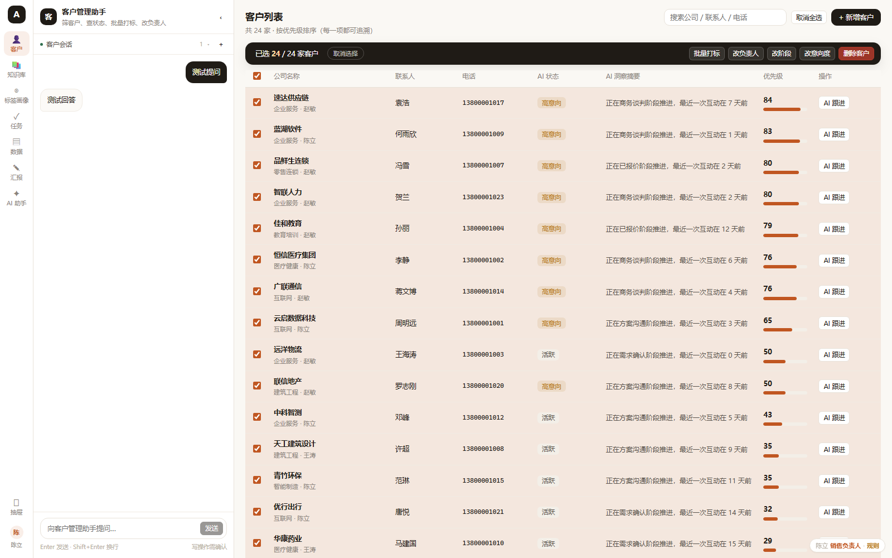
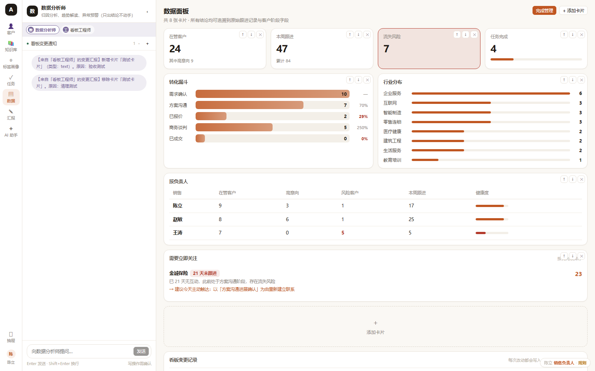
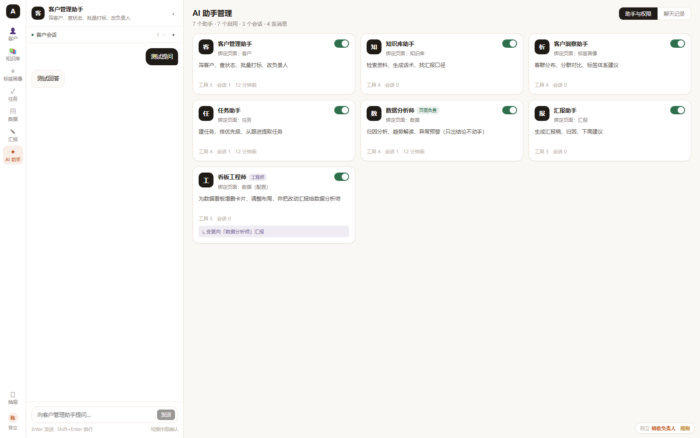
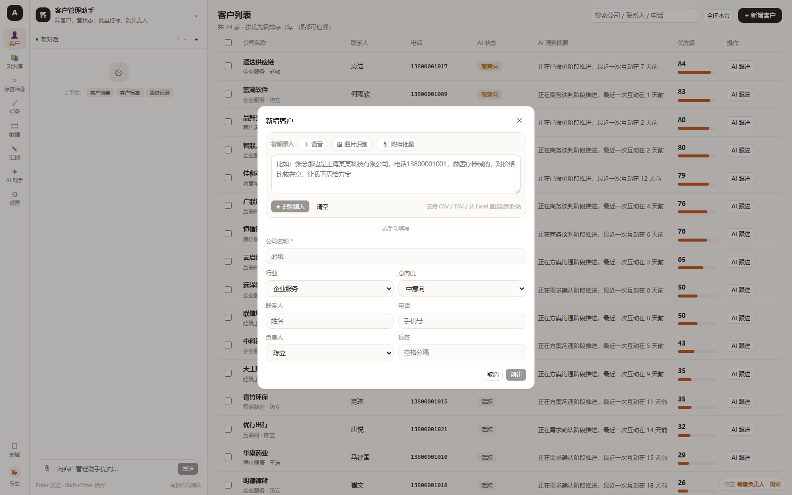
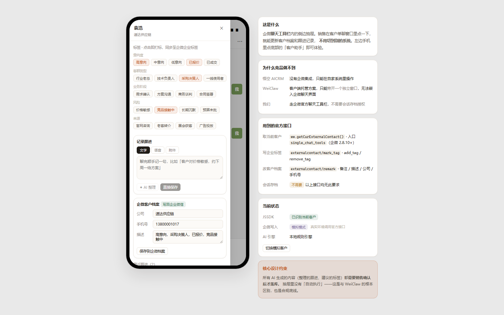
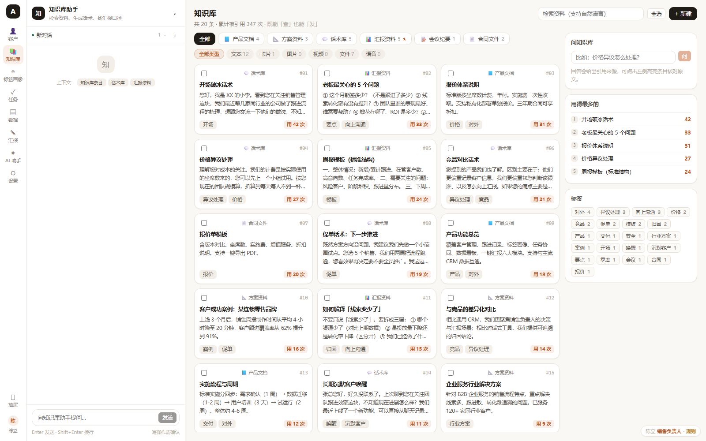
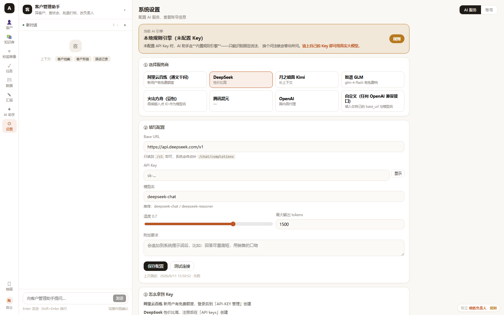

<div align="center">

# AICRM

**面向销售负责人的 AI 决策与汇报工作台**

不是「又一个 AI CRM」，而是解决两件具体的事：**今天该抓谁**、**怎么向老板解释**。

[](https://nodejs.org/)
[](https://vuejs.org/)
[](LICENSE)
[](#技术选型)



</div>

---

## 这是什么

一个**可运行的 MVP 原型**，用来验证一个产品假设：

> 销售管理工具的核心矛盾不是「记录得不够全」，而是**记录完了也没用** ——
> 销售不知道该跟谁，负责人不知道该怎么向上汇报。

所以它做了三件别人没做的事：

| | 悟空 AICRM | WeiClaw | **本项目** |
|---|---|---|---|
| 核心范式 | 对话式**管理** | 对话式**执行** | 对话式管理（更深） |
| AI 员工切换 | 用户**手动**选上下文 | 无场景概念 | **随页面自动切换** |
| 企微嵌入 | 无 | 客户端托管，只能旁开窗口 | **官方聊天工具栏** |
| 向上汇报 | 无 | 无 | **一键汇报 + 归因** |
| 知识库 | 只对客户说 | 只给自动回复用 | **查+发合体，含「汇报资料」** |

---

## 快速开始

只需要 **Node.js ≥ 22.5**（用到内置的 `node:sqlite`）。**不需要装数据库。**

```bash
git clone <你的仓库地址>
cd aicrm

npm run setup     # 安装前端依赖 + 构建（约 30 秒）
npm start         # 启动
```

打开 **http://127.0.0.1:8787**

登录账号：

```
账号：chenli
密码：123456
```

> **不需要任何 AI API Key 就能跑** —— 默认走内置规则引擎，功能完整可体验。
> 想要真正的 AI 能力，到「系统设置 → AI 服务」填自己的 Key（见下方）。

### 开发模式（改代码热更新）

```bash
npm run dev:server     # 终端 1：后端 8787
npm run dev:web        # 终端 2：前端 5273（带热更新）
```

---

## 功能

### 对话工作台 —— AI 员工随场景自动切换

左侧常挂对话栏，**没有「选择上下文」这个控件**。你切到哪个页面，它自动变成那个页面的 AI 员工：

| 切到 | AI 员工 | 能做什么 |
|---|---|---|
| 客户 | 客户管理助手 | 筛客户、查状态、批量打标 |
| 知识库 | 知识库助手 | 检索资料、生成话术、找汇报口径 |
| 标签画像 | 客户洞察助手 | 客群分布、分群对比 |
| 任务 | 任务助手 | 建任务、排优先级 |
| 数据 | 数据分析师 | 归因分析（只出结论不动手） |
| 汇报 | 汇报助手 | 生成汇报稿、解释数字 |

**AI 的产出直接落进工作区**，不只是聊天：

```
「找出 30 天没跟进的意向客户」
  → 右侧客户列表自动筛选 + 显示「对话筛选」徽条

「给高意向客户建跟进任务」
  → 任务页出现「AI 拟了 N 个操作」，确认后才创建
```

> **所有写操作都需要用户确认才落库** —— 这是合规底线，也是与「自动执行」类工具的根本区别。



### AI 助手体系（7 个助手，含一个「元助手」）

每个助手 = 一个页面 + 一套工具 + 一个上下文范围 + **独立的会话列表**。

其中 **看板工程师** 是个元助手：它不分析业务，而是**配置数据看板本身**，并且
**每次改动都向该页面的负责助手（数据分析师）汇报** —— 写进他的会话里。

原因很实际：**看板被改了他不知道，他的分析结论就会和用户看到的看板对不上。**



### 智能录入 —— 所有「新建」都支持

客户 / 任务 / 知识库的新建弹窗顶部都有一条智能录入栏：

| 方式 | 说明 | 需要 Key |
|---|---|---|
| 🎙 **语音** | 浏览器语音识别，说完转文字再解析 | 不需要 |
| 🖼 **图片识别** | 名片 / 表格截图 → 模型 OCR → 自动填表 | 需要视觉模型 |
| 📎 **附件批量** | CSV / TSV / 从 Excel 直接复制粘贴 | 不需要 |
| ✍️ **自由文本** | 说一段话自动抽字段 | 不需要（有 Key 更准）|

输入：

> 张总那边是上海云启数据科技有限公司，做医疗器械的，电话13800001001，对价格比较在意

自动填出：公司名 / 联系人 / 电话 / 行业=医疗健康 / 标签=价格敏感



### 企微内嵌抽屉

销售在客户单聊窗口里点一下，就能更新客户档案和跟进记录，**不用切到别的系统**。

走**官方聊天工具栏**（`ww.getCurExternalContact()`），**不需要会话存档授权** ——
这是这套方案能成立的根本原因。



### 知识库：查 + 发 + 对老板说

三类知识，竞品都没有第三类：

- **产品文档 / 方案资料**（对客户说）
- **话术库**（对客户说）
- **汇报资料**（对老板说）★ ←《如何解释「线索变少了」》《老板最关心的 5 个问题》

能力：中文 2-gram 检索、RAG 问答（带引用来源）、按客户标签定向匹配话术、
**一键引用到跟进或汇报**、使用次数统计。



---

## 配置 AI（可选）

不配也能用（走规则引擎），配了才是真 AI。

「系统设置 → AI 服务」内置 8 个服务商预设：

| 服务商 | 说明 |
|---|---|
| **智谱 GLM** | `glm-4-flash` 有免费档，**推荐先试这个** |
| **阿里云百炼** | 新用户有免费额度 |
| **DeepSeek** | 性价比高 |
| Moonshot / 火山方舟 / 腾讯混元 / OpenAI / 自定义 | 任何 OpenAI 兼容接口都行 |

配置**只存在你自己的服务器**（`data/settings.json`），密钥在前端只回显后四位。

也可以走环境变量（服务端统一供给，使用者无需配置）：

```bash
AI_API_KEY=sk-xxx \
AI_BASE_URL=https://open.bigmodel.cn/api/paas/v4 \
AI_MODEL=glm-4-flash \
npm start
```

优先级：**用户在设置页填的 > 环境变量 > 本地规则引擎**



---

## 技术选型

| 层 | 选型 | 为什么 |
|---|---|---|
| 后端 | **纯 `node:http`，零依赖** | 没有依赖就没有供应链风险，`node server/index.js` 直接跑 |
| 数据库 | **`node:sqlite`（Node 内置）** | 单文件、免安装、免运维，MVP 阶段最省事 |
| 前端 | Vue 3 + Vite | 只装 2 个依赖，不用 UI 框架，手写设计令牌 |
| AI 调用 | 原生 `fetch` + SSE | 不引入 SDK，任何 OpenAI 兼容接口都能接 |

**前端 gzip 后总共约 82KB。**

整个后端只有 9 个文件、`require` 的全是 Node 内置模块。
好处是部署时不会因为某个传递依赖炸掉，也让「clone 下来就能跑」这件事真的成立。

---

## 项目结构

```
aicrm/
├── server/                 后端（零依赖）
│   ├── index.js            HTTP 路由 + SSE 流式对话 + 静态托管
│   ├── db.js               SQLite 建表 + 灌演示数据
│   ├── store.js            客户/跟进/任务 + 优先级评分 + 汇报生成
│   ├── ai.js               场景化 AI 员工（规则引擎 + 模型接入）
│   ├── extract.js          智能录入引擎（文本/表格/OCR 解析）
│   ├── knowledge.js        知识库检索与问答
│   ├── assistants.js       AI 助手体系 + 分助手会话 + 看板卡片
│   ├── auth.js             账号与角色权限
│   ├── settings.js         AI 服务配置（用户自带 Key）
│   └── seed-kb.js          知识库演示数据
├── web/                    Vue 3 + Vite
│   └── src/components/     12 个组件（对话工作台 / 抽屉 / 各业务页）
├── data/                   运行时生成（已 gitignore）
└── docs/screenshots/
```

---

## 部署

完整部署指南见 **[DEPLOY.md](DEPLOY.md)**，包含：

- pm2 + Nginx 部署（**含 SSE 缓冲陷阱**：漏了 `proxy_buffering off`，AI 回复会卡住）
- **企业微信抽屉的完整配置步骤**（可直接发给客户管理员照做）
- 上线前必补清单

### Docker

```bash
docker compose up -d      # → http://localhost:8787
```

### 一键部署

仓库里带好了配置，可以直接连到平台：

- **Railway** → `railway.json`
- **Render** → `render.yaml`（含 1GB 持久磁盘挂载到 `/app/data`）

---

## 已知限制

这是个 **MVP 原型**，不是生产系统。如实说明：

| 项 | 现状 |
|---|---|
| 密码存储 | **明文硬编码**（`server/auth.js`），上线前必须改 bcrypt |
| 会话令牌 | 存内存，重启失效且无过期 |
| 多租户 | 单租户，卖给多家客户需改造 |
| 数据备份 | 需自行备份 `data/aicrm.db`（含 WAL 文件） |
| 企微集成 | 抽屉是**模拟界面**，真实接入见 DEPLOY.md 第三节 |
| 仍为占位的按钮 | 客户详情字段编辑、新建自定义助手、全局搜索 |

重置演示数据：

```bash
npm run reset
# 或
curl -X POST http://127.0.0.1:8787/api/admin/reset
```

---

## 设计来源

这个原型的产品决策来自对两个竞品的拆解：

- **悟空 AICRM**（直接竞品）：对话式管理、8 个应用上下文、知识库
- **WeiClaw**（间接竞品）：AI 员工、素材库、客户端托管方案

拆解维度包括表现层 / 框架层 / 结构层 / 范围层 / 战略层，以及 Kano 模型和
Gartner 技术成熟度曲线定位。关键结论已体现在上面的功能对比表里。

---

## License

[MIT](LICENSE)
